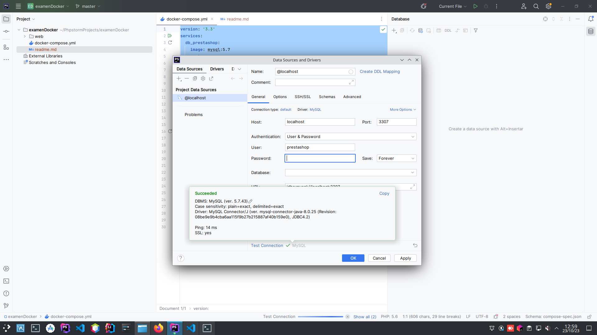
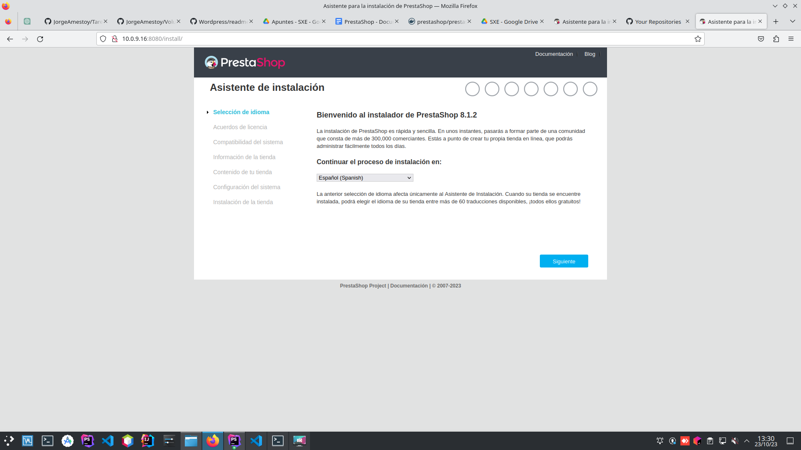
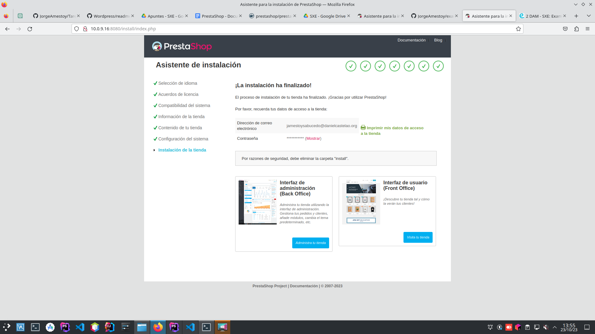
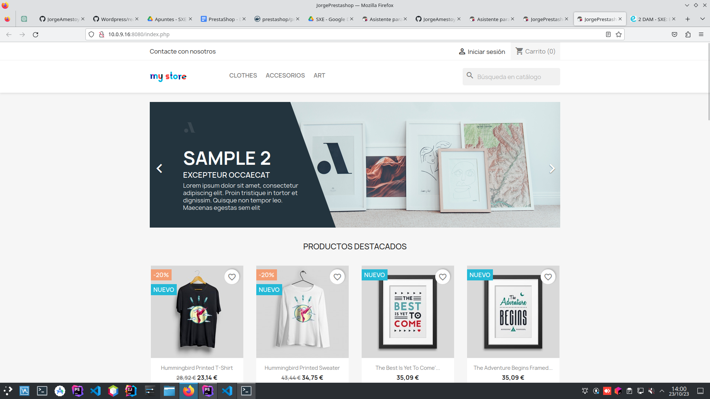

# EXAMEN DOCKER

**Prestashop** es una plataforma de comercio electrónico de código abierto que
permite a las empresas y personas crear tiendas en línea.
Es una solución completa y flexible para la creación y gestión de tiendas en línea,
lo que lo convierte en una opción popular para pequeñas y medianas empresas
que desean vender productos y servicios en Internet.


### CREACIÓN DOCKER-COMPOSE.YML
Creamos un fichero *.yml* y escribimos el código para definir
la configuración necesaria y ejecutar **Prestashop**:

```
version: '3.3'
services:
  db_prestashop:
    image: mysql:5.7
    ports:
      - "3307:3306"
    volumes:
      - db_data:/var/lib/mysql

    environment:
      - MYSQL_ROOT_PASSWORD=prestashop
      - MYSQL_DATABASE=prestashop
      - MYSQL_USER=prestashop
      - MYSQL_PASSWORD=prestashop

  presta:
    depends_on:
      - db_prestashop
    image: prestashop/prestashop:latest
    ports:
      - "8080:80"
    volumes:
      - './web:/var/www/html'
    environment:
      DB_SERVER: db_prestashop
      DB_USER: prestashop
      DB_PASSWORD: prestashop
      DB_NAME: prestashop
volumes:
  db_data: {}
```
**Servicios**: En este caso se definen, dos servicios:
- db_prestashop: usando una imagen de la base de datos MySQL, se crean variables de entorno, entre ellas,
  las credenciales de usuario, y se exponen los puertos
  para que otros servicios accedan a esta.<br>
- presta: usando la imagen más reciente de Prestashp, se establecen
  las variables de entorno para poder conectarse.

**Volúmenes**: Creamos un volumen db_data para almacenar los datos de MySQL y 
otro volumen para poder personalizar los archivos de PrestaShop.

**Puertos**: Se consigue que el puerto 3307 del sistema host se asocie al puerto 3306
del contenedor.

Posteriormente, iniciamos los contenedores con el comando:
```
$ DOCKER-COMPOSE UP -D
```
Desde la Interfaz, entramos en la base de datos para testear que
la conexión funciona correctamente:



Para comprobar que funciona correctamente, escribimos la dirección IP seguido del puerto 8080
en el navegador: http://10.0.9.16:8080 .



Desde la misma página rellenamos los campos requeridos para completar
la instalación de dicha base de datos hasta finalizar:



Dando como resultado final: 


